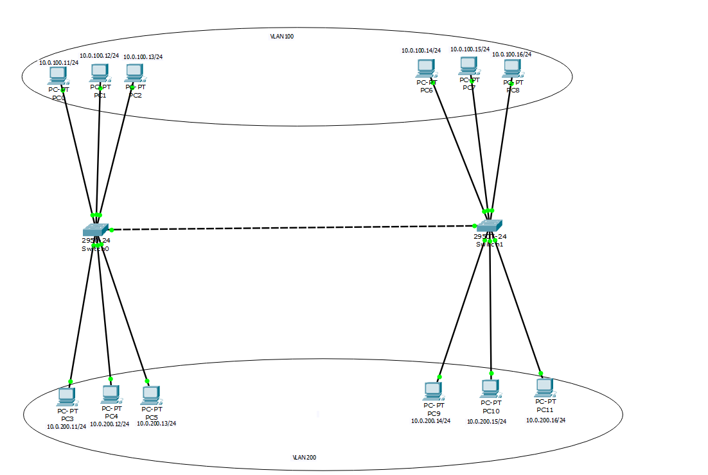

# Cisco Packet Tracer Network Design

Hands-on network design and configuration work from **CIT 40200 — Design and Implementation of Local Area Networks**. The repository preserves the original Cisco Packet Tracer topologies and presents the strongest documented project as a concise case study.

## VLAN segmentation project

### Objective

Build a two-switch LAN that separates endpoints into VLAN 100 and VLAN 200 while extending each VLAN across the switch-to-switch link.

### Design

- Two Cisco 2950 switches
- Twelve simulated workstations
- VLAN 100 using the `10.0.100.0/24` lab subnet
- VLAN 200 using the `10.0.200.0/24` lab subnet
- An inter-switch trunk carrying both VLANs
- Unused switch ports reviewed as part of the validation process

### Validation

- Confirmed connectivity between hosts assigned to the same VLAN across different switches.
- Confirmed that hosts in different VLANs could not communicate without a Layer 3 routing function.
- Reviewed VLAN membership, interface state, trunk behavior, and unused ports from the switch CLI.

The failed cross-VLAN ping is an expected result of the Layer 2 segmentation design, not a connectivity defect.

### Validation evidence

| Same-VLAN connectivity across switches | Expected cross-VLAN isolation |
| --- | --- |
|  |  |

| VLAN membership on switch 0 | VLAN membership on switch 1 |
| --- | --- |
|  |  |

## Additional network/VPN topology

[`packet-tracer/cit402-network-lab.pkt`](packet-tracer/cit402-network-lab.pkt) preserves a second topology created in Cisco Packet Tracer for the same course. It involved manual device interconnection and VPN/network configuration. The original simulation is included so the configuration can be inspected directly in Packet Tracer; no unsupported implementation details are claimed here because a separate written report was not available.

## Repository contents

- [`vlan-segmentation-lab.pkt`](packet-tracer/vlan-segmentation-lab.pkt) — VLAN topology and device configuration
- [`cit402-network-lab.pkt`](packet-tracer/cit402-network-lab.pkt) — additional network/VPN lab topology
- [`images/`](images/) — sanitized topology and validation evidence

## Skills demonstrated

- Cisco Packet Tracer
- Physical and logical topology design
- Switch CLI configuration
- VLAN creation and access-port assignment
- 802.1Q trunking concepts
- IPv4 subnet planning
- Connectivity testing and troubleshooting
- Network segmentation and basic security validation

## Privacy and academic-integrity note

The IP addresses shown are private lab addresses. Course instructions, answer keys, credentials, and third-party materials are not included.

## About the author

Built by **Ahmed Balde** as part of a networking, infrastructure, and cybersecurity portfolio. See more work on [GitHub](https://github.com/fetachino).
